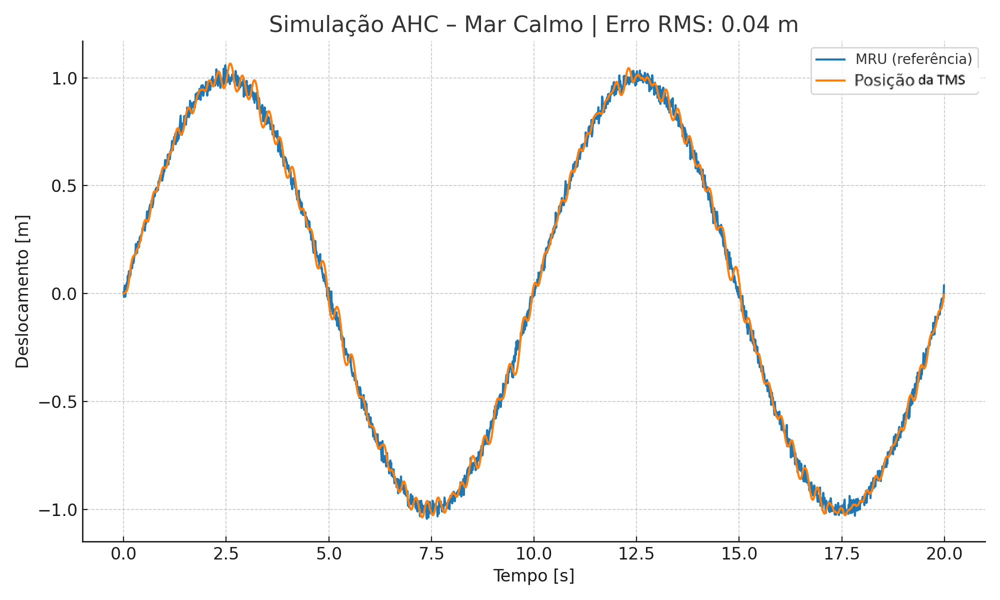
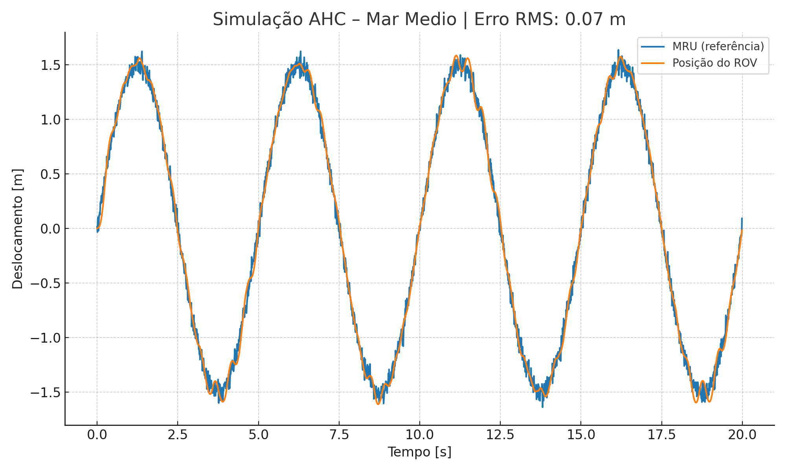
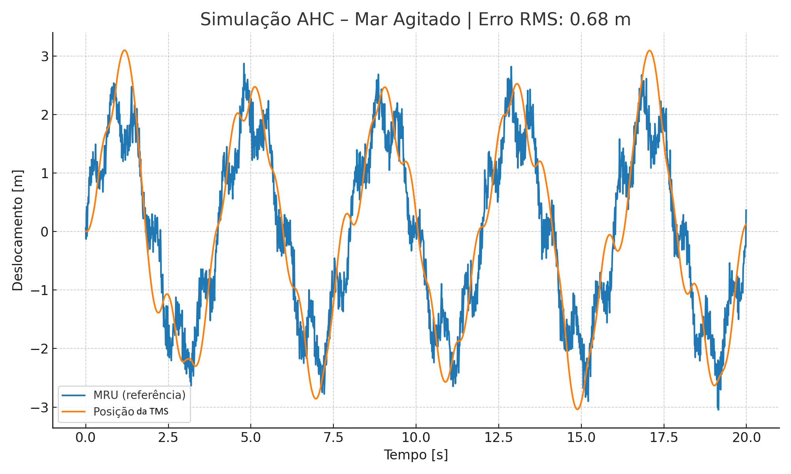

# Active Heave Compensation (AHC) para ROV – Simulação em Python

## 1. Introdução
Em operações offshore com ROVs (Remotely Operated Vehicles), o movimento vertical da embarcação causado por ondas — **heave** — é transmitido ao veículo pelo umbilical. Esse movimento pode prejudicar inspeções e intervenções, aumentando riscos e desgaste do sistema.

O **Active Heave Compensation (AHC)** é um sistema de controle que atua no guincho do TMS (Tether Management System) para cancelar o efeito do heave, mantendo o ROV estável em relação ao fundo.

Este estudo apresenta um **modelo simplificado** de AHC implementado em **Python**, com ênfase na modelagem de controle e análise de desempenho em diferentes condições de mar.

---

## 2. Arquitetura do Sistema
O modelo representa a malha de controle de forma simplificada:

- **MRU**: mede deslocamento vertical do navio. No modelo, é o sinal sintético de heave. Na prática, MRUs usam IMUs (acelerômetros/giroscópios) com filtragem.
- **Controlador PID**: calcula o comando de torque para compensar o heave (ganhos \(K_p\), \(K_i\), \(K_d\)).
- **Válvula proporcional**: converte comando elétrico em torque hidráulico, com **zona morta** e **saturação**.
- **Guincho**: modelo de 2ª ordem com **inércia \(J\)** e **atrito viscoso \(b\)**.
- **Encoder**: realimenta a posição do cabo para fechar a malha.

Um diagrama minimalista de blocos:
```
    Heave (MRU) → [PID] → [Válvula prop.] → [Guincho J,b] → θ
                                    ↑________________________↓ (Encoder)
```

---

## 3. Modelagem Matemática

**Guincho (2ª ordem):**
\[
\dot{\theta} = \omega,\quad 
\dot{\omega} = \frac{T_m - b\,\omega}{J}
\]

**PID:**
\[
u(t) = K_p\,e(t) + K_i \int e(t)\,dt + K_d\,\frac{de(t)}{dt}
\]

**Não linearidades (atuador):**
- Zona morta: \( |u| < 0{,}1 \Rightarrow T_m = 0 \)
- Saturação de torque: \( |T_m| \le 100 \,\text{N·m} \)

**Modelagem do heave \(h(t)\):**

- **Mar calmo**: \( h(t) = 1{,}0 \sin(2\pi \cdot 0{,}1\,t) + 0{,}02\,\mathcal{N}(0,1) \)
- **Mar médio**: \( h(t) = 1{,}5 \sin(2\pi \cdot 0{,}2\,t) + 0{,}05\,\mathcal{N}(0,1) \)
- **Mar agitado**:
  \[
  h(t) = 2{,}0 \sin(2\pi \cdot 0{,}25\,t) + 0{,}5 \sin(2\pi \cdot 1{,}5\,t) + 0{,}2\,\mathcal{N}(0,1)
  \]

---

## 4. Implementação em Python
**Stack:** `numpy`, `scipy.integrate.solve_ivp`, `matplotlib`.

Estrutura principal do código (`ahc_simulacao.py`):
```python
class PID: ...
def gerar_heave(t, tipo): ...
def modelo_ahc(t_now, y, ref_signal): ...
sol = solve_ivp(modelo_ahc, [0, t_final], y0, t_eval=t, args=(heave,), method='RK45')
```

Parâmetros utilizados (exemplo):
- \(K_p = 5\times10^4\), \(K_i = 2\times10^3\), \(K_d = 1\times10^4\)
- \(J = 5.0\), \(b = 2.0\)
- Zona morta = 0.1; Saturação de torque = ±100 N·m

---

## 5. Resultados
**Gráficos** (exemplos gerados):
- `plot_ahc_calmo_anotado.png`
- `plot_ahc_medio_anotado.png`
- `plot_ahc_agitado_anotado.png`





**Resumo qualitativo:**
- Mar calmo: rastreamento quase perfeito.
- Mar médio: pequeno atraso, sistema estável.
- Mar agitado: limitação de torque + zona morta → desempenho reduzido.

> *Nota:* Caso queira computar RMS no próprio script, calcule `rms = np.sqrt(np.mean((heave - theta)**2))` após a integração.

---

## 6. Como rodar
```bash
# criar venv (opcional)
python -m venv .venv && . .venv/bin/activate  # Windows: .venv\Scripts\activate

# instalar deps
pip install -r requirements.txt

# escolher cenário no código (calmo | medio | agitado)
python ahc_simulacao.py
```

---

## 7. Estrutura do Projeto
```text
ahc-rov-sim/
├── ahc_simulacao.py
├── plot_ahc_calmo_anotado.png
├── plot_ahc_medio_anotado.png
├── plot_ahc_agitado_anotado.png
├── requirements.txt
├── .gitignore
└── README.md
```

---

## 8. Licença
Livre para uso educacional e demonstração de portfólio.
