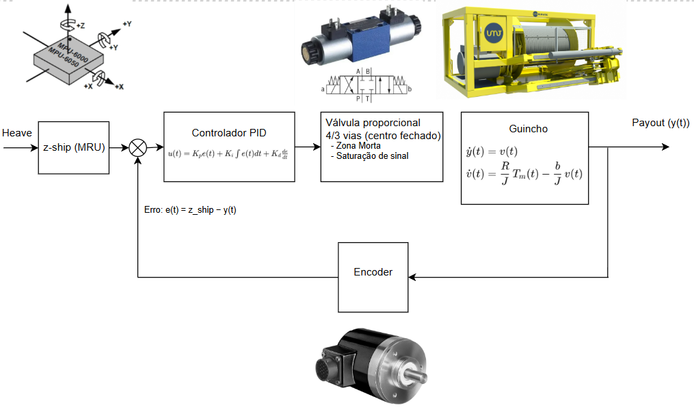

# Active Heave Compensation (AHC) para ROV – Simulação em Python

## 1. Introdução
Em operações offshore com ROVs (Remotely Operated Vehicles), o movimento vertical da embarcação causado por ondas — **heave** — é transmitido ao veículo pelo umbilical. Esse movimento pode prejudicar inspeções e intervenções, aumentando riscos e desgaste do sistema.

O **Active Heave Compensation (AHC)** é um sistema de controle que atua no guincho do TMS (Tether Management System) para cancelar o efeito do heave, mantendo o ROV estável em relação ao fundo.

Este estudo apresenta um **modelo simplificado** de AHC implementado em **Python**, com ênfase na modelagem de controle e análise de desempenho em diferentes condições de mar.

---

## 2. Arquitetura do Sistema
O modelo representa a malha de controle de forma simplificada:

- **MRU**: mede deslocamento vertical do navio. No modelo, é o sinal sintético de heave. Na prática, MRUs usam IMUs (acelerômetros/giroscópios) com filtragem.
- **Controlador PID**: calcula o comando de torque para compensar o heave (ganhos \(K_p\), \(K_i\), \(K_d\)).
- **Válvula proporcional**: converte comando elétrico em torque hidráulico, com **zona morta** e **saturação**.
- **Guincho**: modelo de 2ª ordem com **inércia \(J\)** e **atrito viscoso \(b\)**.
- **Encoder**: realimenta a posição do cabo para fechar a malha.

Diagrama de Blocos do sistema:




---

## 3. Resultados
**Gráficos** (exemplos gerados):
- `plot_ahc_calmo_anotado.png`
- `plot_ahc_medio_anotado.png`
- `plot_ahc_agitado_anotado.png`


**Resumo qualitativo:**
- Mar calmo: rastreamento quase perfeito.
- Mar médio: pequeno atraso, sistema estável.
- Mar agitado: limitação de torque + zona morta → desempenho reduzido.

> *Nota:* Caso queira computar RMS no próprio script, calcule `rms = np.sqrt(np.mean((heave - theta)**2))` após a integração.

---

## 4. Como rodar
```bash
# criar venv (opcional)
python -m venv .venv && . .venv/bin/activate  # Windows: .venv\Scripts\activate

# instalar deps
pip install -r requirements.txt

# escolher cenário no código (calmo | medio | agitado)
python ahc_simulacao.py
```

---

## 5. Estrutura do Projeto
```text
ahc-rov-sim/
├── ahc_simulacao.py
├── plot_ahc_calmo_anotado.png
├── plot_ahc_medio_anotado.png
├── plot_ahc_agitado_anotado.png
├── requirements.txt
├── .gitignore
└── README.md
```

---

## 6. Licença
Livre para uso educacional e demonstração de portfólio.
